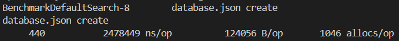
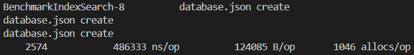
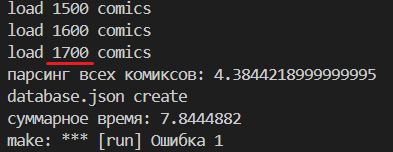
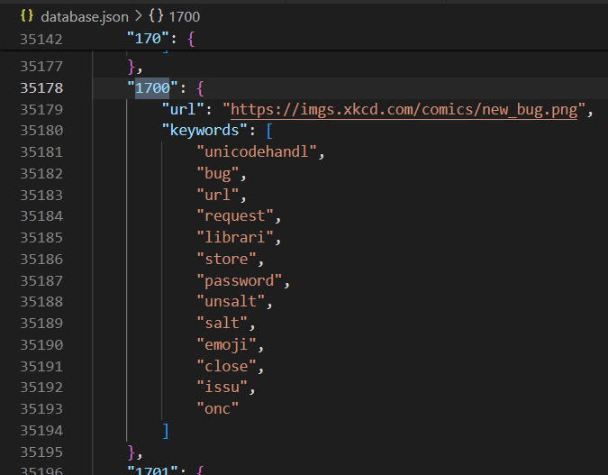
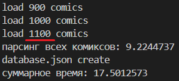

## Yadro-Golang

# Third task

* в среднем при запуске тратит ~9 секукнд на поиск первого документа и ~25 на парсинг и запись в бд всех комиксов

* лучшие показатели при многоразовом запуске ~1.5 секунды на первый документ и ~6 секунд на обработку комиксов

* при прерывании программы спаршенные комиксы сохранятся в бд 
прерывание на ~1700-ом комиксе:

файл базы с сохранёными комиксами:

* при повторном запуске считаеться 2900 - 1700 ~ 1200 комиксов

база данных: 

